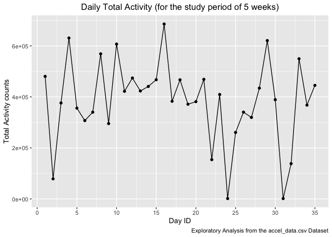
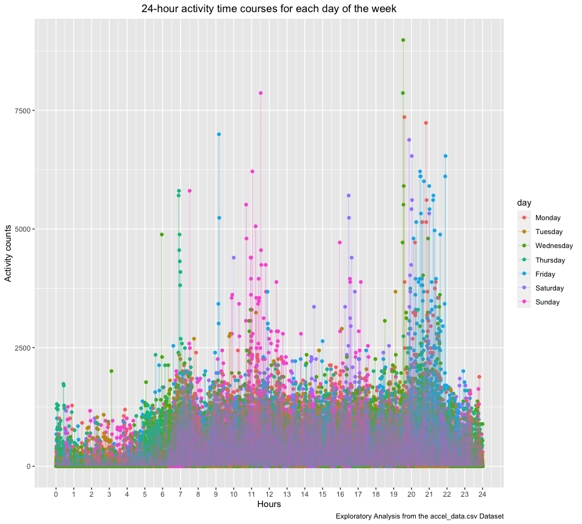

Homework 3
================
mm5951
2022-10-13

## Problem 1

Solution provided by teaching team.

## Problem 2

Let’s investigate the accelerometer dataset for the diagnosis of
congestive heart failure (CHF).

### Data import

I first **load, tidy, and wrangle data** using the `read_csv` and
`janitor::clean_names` functions. A variable to distinguish between
weekdays and weekends is created using `mutate` function and placed next
to the “day” column using `relocate`.

Next, I address the “activity\_\*” variables, which correspond to the
activity counts for each minute of a 24-hour day starting at midnight.
The dataframe is transposed using the `pivot_longer` function, by which
all activity observations are classified under “minute” according to the
minute (1, 1440) of each of the five days to which they correspond, and
its associated value falls under “activity_counts”.

Finally, the resulting variables are coerced into number and factor
types as adequate using the `as.numeric` and `factor` functions inside a
`mutate`.

``` r
accel_df = read_csv("data_problem2/accel_data.csv") %>%
  janitor::clean_names() %>% 
  mutate(
    weekend_or_weekday = if_else((day == "Saturday" | day == "Sunday"),"Weekend","Weekday")) %>% 
  relocate(week,day_id, day,weekend_or_weekday) %>% 
  pivot_longer(
    cols = activity_1:activity_1440,
    names_to = "minute",
    values_to = "activity_counts",
    names_prefix = "activity_"
   ) %>% 
  mutate(
  minute = as.numeric(minute),
  day = factor(day, level = c("Monday","Tuesday","Wednesday","Thursday","Friday","Saturday","Sunday")),
  weekend_or_weekday = factor(weekend_or_weekday, level = c("Weekday", "Weekend"))
  )
```

    ## Rows: 35 Columns: 1443
    ## ── Column specification ────────────────────────────────────────────────────────
    ## Delimiter: ","
    ## chr    (1): day
    ## dbl (1442): week, day_id, activity.1, activity.2, activity.3, activity.4, ac...
    ## 
    ## ℹ Use `spec()` to retrieve the full column specification for this data.
    ## ℹ Specify the column types or set `show_col_types = FALSE` to quiet this message.

The `str` function reveals the nature of data of each of the variables
(that is a verification).

``` r
str(accel_df)
```

    ## tibble [50,400 × 6] (S3: tbl_df/tbl/data.frame)
    ##  $ week              : num [1:50400] 1 1 1 1 1 1 1 1 1 1 ...
    ##  $ day_id            : num [1:50400] 1 1 1 1 1 1 1 1 1 1 ...
    ##  $ day               : Factor w/ 7 levels "Monday","Tuesday",..: 5 5 5 5 5 5 5 5 5 5 ...
    ##  $ weekend_or_weekday: Factor w/ 2 levels "Weekday","Weekend": 1 1 1 1 1 1 1 1 1 1 ...
    ##  $ minute            : num [1:50400] 1 2 3 4 5 6 7 8 9 10 ...
    ##  $ activity_counts   : num [1:50400] 88.4 82.2 64.4 70 75 ...

### Dataset description

The accel_df dataset contains five weeks of accelerometer data collected
on a 63 year-old male with BMI 25, who was admitted to the Advanced
Cardiac Care Center of Columbia University Medical Center and diagnosed
with congestive heart failure (CHF).

The “accel_df” dataset contains: \* 50400 observations of activity
(accelerometer data), and \* 6 variables, which are week, day_id, day,
weekend_or_weekday, minute, activity_counts that describe the
information of data.

Notably, minute represents the number of minute of a 24-hour day
starting at midnight, which range from 1, 1440 minutes. Additionally,
activity_counts represent the activity count of the subject of study
collected by accelerometer, ranging from 1, 8982.

### Total Daily Activity

Next, I aggregate across minutes to create a daily total activity
variable using the `group by` function. In order to best understand the
data, it is summarized into a table using the `summarize` and then
`knitr::kable` functions.

``` r
total_act_df = accel_df %>% 
  group_by(day_id) %>% 
  summarize(total_activity = sum(activity_counts)) 
knitr::kable(total_act_df)
```

| day_id | total_activity |
|-------:|---------------:|
|      1 |      480542.62 |
|      2 |       78828.07 |
|      3 |      376254.00 |
|      4 |      631105.00 |
|      5 |      355923.64 |
|      6 |      307094.24 |
|      7 |      340115.01 |
|      8 |      568839.00 |
|      9 |      295431.00 |
|     10 |      607175.00 |
|     11 |      422018.00 |
|     12 |      474048.00 |
|     13 |      423245.00 |
|     14 |      440962.00 |
|     15 |      467420.00 |
|     16 |      685910.00 |
|     17 |      382928.00 |
|     18 |      467052.00 |
|     19 |      371230.00 |
|     20 |      381507.00 |
|     21 |      468869.00 |
|     22 |      154049.00 |
|     23 |      409450.00 |
|     24 |        1440.00 |
|     25 |      260617.00 |
|     26 |      340291.00 |
|     27 |      319568.00 |
|     28 |      434460.00 |
|     29 |      620860.00 |
|     30 |      389080.00 |
|     31 |        1440.00 |
|     32 |      138421.00 |
|     33 |      549658.00 |
|     34 |      367824.00 |
|     35 |      445366.00 |

Next, I investigate apparent trends using the generated table out of
“total_act_df”, as well as some exploratory analyses graphs. To generate
them, the `ggplot` function is used, placing the “day_id” in the X axis
and “total_activity” in the Y axis. A scatterplot is generated with the
`geom_point` argument, and points are united into a continous trend line
using `geom_line`. The resulting graph characteristics are adjusted
using `scale_x_continous` and `theme` to ensure readability.

``` r
ggplot(total_act_df,aes(x = day_id, y = total_activity)) +
  geom_point() +
  geom_line() +
  labs(
    title = "Daily Total Activity (for the study period of 5 weeks)",
    x = "Day ID",
    y = "Total Activity counts",
    caption = "Exploratory Analysis from the accel_data.csv Dataset"
  ) +
  scale_x_continuous(breaks = seq(0,35,by = 5)) +
  theme(plot.title = element_text(hjust = 0.5))
```

<!-- -->

After exploratory analysis, no apparent trend of daily total activity
becomes apparent, rather I conclude it has changed substantially daily
over the five weeks of study period. Therefore, aggregating by total
daily activity does not seem to be of extreme value when analysing the
“accel_df” dataset.

### 24-hour Daily Activity

In order to investigate the dataset differently, I investigate the
accelerometer-recorded activity over the course of the day. To do so, a
different graph is generated using `ggplot`: this time, I place the
minutes in the X axis, and the activity counts in the Y axis. As per
homework instructions, each day of the week is given a different color.
The graph details are adjusted similarly as above.

``` r
accel_df %>% 
  ggplot(aes(x = minute, y = activity_counts, color = day)) +
  geom_point() +
  geom_line(alpha = .3) +
  scale_x_continuous(breaks = seq(0,1440,by = 60),
                     label = seq(0,24,by = 1),
                     limits = c(0,1440)) +
  labs(
    title = "24-hour activity time courses for each day of the week",
    x = "Hours",
    y = "Activity counts",
    caption = "Exploratory Analysis from the accel_data.csv Dataset"
  ) +
  theme(plot.title = element_text(hjust = 0.5))
```

<!-- -->

Some patterns become apparent when looking into the resulting
visualization. First, the studied individual appears to be active
between 6 AM and 22 AM daily. Some daily patterns are to be noted: for
instance, Fridays at 9 AM there’s an activity peak, and so there is
Wednesdays at 8 PM.

## Problem 3

Pending
