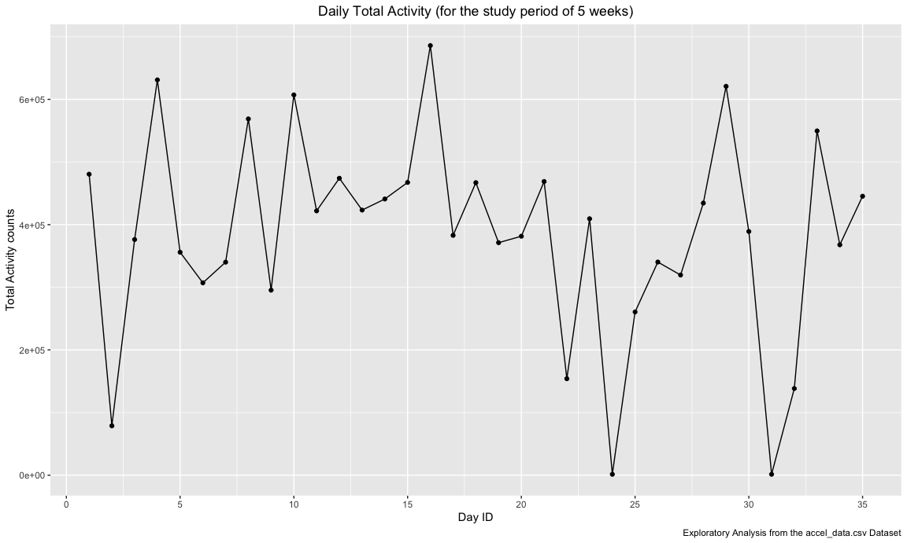
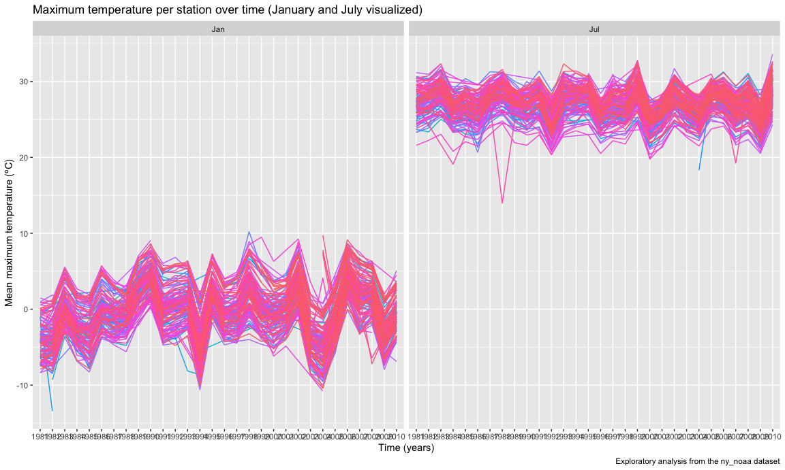
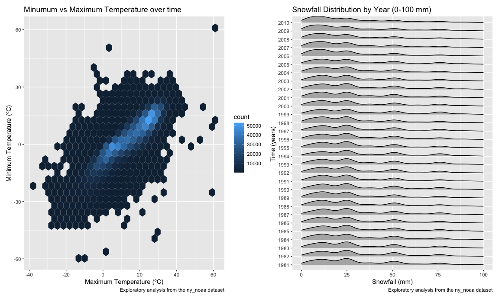

Homework 3
================
mm5951
2022-10-17

## Problem 1

Solution provided by teaching team.

## Problem 2

Let’s investigate the accelerometer dataset for the diagnosis and
follow-up of congestive heart failure (CHF).

### Data import

I first **load, tidy, and wrangle data** using the `read_csv` and
`janitor::clean_names` functions. A variable to distinguish between
weekdays and weekends is created using `mutate` function and placed next
to the “day” column using `relocate`.

Next, I \*\*address the “activity\_\*” variables\*\*, which correspond
to the activity counts for each minute of a 24-hour day starting at
midnight. The dataframe is transposed using the `pivot_longer` function,
by which all activity observations are classified under “minute”
according to the minute (1, 1440) of each of the five days to which they
correspond, and its associated value falls under “activity_counts”.

Finally, the resulting variables are coerced into number and factor
types as adequate using the `as.numeric` and `factor` functions inside a
`mutate`.

``` r
accel_df = read_csv("data_problem2/accel_data.csv") %>%
  janitor::clean_names() %>% 
  mutate(
    weekend_or_weekday = if_else((day == "Saturday" | day == "Sunday"),"Weekend","Weekday")) %>% 
  relocate(week,day_id, day,weekend_or_weekday) %>% 
  pivot_longer(
    cols = activity_1:activity_1440,
    names_to = "minute",
    values_to = "activity_counts",
    names_prefix = "activity_"
   ) %>% 
  mutate(
  minute = as.numeric(minute),
  day = factor(day, level = c("Monday","Tuesday","Wednesday","Thursday","Friday","Saturday","Sunday")),
  weekend_or_weekday = factor(weekend_or_weekday, level = c("Weekday", "Weekend"))
  )
```

    ## Rows: 35 Columns: 1443
    ## ── Column specification ────────────────────────────────────────────────────────
    ## Delimiter: ","
    ## chr    (1): day
    ## dbl (1442): week, day_id, activity.1, activity.2, activity.3, activity.4, ac...
    ## 
    ## ℹ Use `spec()` to retrieve the full column specification for this data.
    ## ℹ Specify the column types or set `show_col_types = FALSE` to quiet this message.

The `str` function reveals the nature of data of each of the variables
(that is a verification).

``` r
str(accel_df)
```

    ## tibble [50,400 × 6] (S3: tbl_df/tbl/data.frame)
    ##  $ week              : num [1:50400] 1 1 1 1 1 1 1 1 1 1 ...
    ##  $ day_id            : num [1:50400] 1 1 1 1 1 1 1 1 1 1 ...
    ##  $ day               : Factor w/ 7 levels "Monday","Tuesday",..: 5 5 5 5 5 5 5 5 5 5 ...
    ##  $ weekend_or_weekday: Factor w/ 2 levels "Weekday","Weekend": 1 1 1 1 1 1 1 1 1 1 ...
    ##  $ minute            : num [1:50400] 1 2 3 4 5 6 7 8 9 10 ...
    ##  $ activity_counts   : num [1:50400] 88.4 82.2 64.4 70 75 ...

### Dataset description

The accel_df dataset contains five weeks of accelerometer data collected
on a 63 year-old male with BMI 25, who was admitted to the Advanced
Cardiac Care Center of Columbia University Medical Center and diagnosed
with congestive heart failure (CHF).

The “accel_df” dataset contains: \* 50400 observations of activity
(accelerometer data), and \* 6 variables, which are week, day_id, day,
weekend_or_weekday, minute, activity_counts that describe the
information of data.

Notably, minute represents the number of minute of a 24-hour day
starting at midnight, which range from 1, 1440 minutes. Additionally,
activity_counts represent the activity count of the subject of study
collected by accelerometer, ranging from 1, 8982.

### Total Daily Activity

Next, I **aggregate across minutes** to create a daily total activity
variable using the `group by` function. In order to best understand the
data, it is summarized into a table using the `summarize` and then
`knitr::kable` functions.

``` r
total_act_df = accel_df %>% 
  group_by(day_id) %>% 
  summarize(total_activity = sum(activity_counts)) 
knitr::kable(total_act_df)
```

| day_id | total_activity |
|-------:|---------------:|
|      1 |      480542.62 |
|      2 |       78828.07 |
|      3 |      376254.00 |
|      4 |      631105.00 |
|      5 |      355923.64 |
|      6 |      307094.24 |
|      7 |      340115.01 |
|      8 |      568839.00 |
|      9 |      295431.00 |
|     10 |      607175.00 |
|     11 |      422018.00 |
|     12 |      474048.00 |
|     13 |      423245.00 |
|     14 |      440962.00 |
|     15 |      467420.00 |
|     16 |      685910.00 |
|     17 |      382928.00 |
|     18 |      467052.00 |
|     19 |      371230.00 |
|     20 |      381507.00 |
|     21 |      468869.00 |
|     22 |      154049.00 |
|     23 |      409450.00 |
|     24 |        1440.00 |
|     25 |      260617.00 |
|     26 |      340291.00 |
|     27 |      319568.00 |
|     28 |      434460.00 |
|     29 |      620860.00 |
|     30 |      389080.00 |
|     31 |        1440.00 |
|     32 |      138421.00 |
|     33 |      549658.00 |
|     34 |      367824.00 |
|     35 |      445366.00 |

Next, I **investigate apparent trends** using the generated table out of
“total_act_df”, as well as some exploratory analyses graphs. To generate
them, the `ggplot` function is used, placing the “day_id” in the X axis
and “total_activity” in the Y axis. A scatterplot is generated with the
`geom_point` argument, and points are united into a continous trend line
using `geom_line`. The resulting graph characteristics are adjusted
using `scale_x_continous` and `theme` to ensure readability.

``` r
ggplot(total_act_df,aes(x = day_id, y = total_activity)) +
  geom_point() +
  geom_line() +
  labs(
    title = "Daily Total Activity (for the study period of 5 weeks)",
    x = "Day ID",
    y = "Total Activity counts",
    caption = "Exploratory Analysis from the accel_data.csv Dataset"
  ) +
  scale_x_continuous(breaks = seq(0,35,by = 5)) +
  theme(plot.title = element_text(hjust = 0.5))
```



After exploratory analysis, no apparent trend of daily total activity
becomes apparent, rather I conclude it has changed substantially daily
over the five weeks of study period. Therefore, aggregating by total
daily activity does not seem to be of extreme value when analysing the
“accel_df” dataset.

### 24-hour Daily Activity

In order to investigate the dataset differently, I **investigate the
accelerometer-recorded activity over the course of the day**. To do so,
a different graph is generated using `ggplot`: this time, I place the
minutes in the X axis, and the activity counts in the Y axis. As per
homework instructions, each day of the week is given a different color.
The graph details are adjusted similarly as above.

``` r
accel_df %>% 
  ggplot(aes(x = minute, y = activity_counts, color = day)) +
  geom_point() +
  geom_line(alpha = .3) +
  scale_x_continuous(breaks = seq(0,1440,by = 60),
                     label = seq(0,24,by = 1),
                     limits = c(0,1440)) +
  labs(
    title = "24-hour activity time courses for each day of the week",
    x = "Hours",
    y = "Activity counts",
    caption = "Exploratory Analysis from the accel_data.csv Dataset"
  ) +
  theme(plot.title = element_text(hjust = 0.5))
```


Some patterns become apparent when looking into the resulting
visualization. First, the studied individual appears to be active
between 6 AM and 22 AM daily. Some daily patterns are to be noted: for
instance, Fridays at 9 AM there’s an activity peak, and so there is
Wednesdays at 8 PM.

## Problem 3

This problem uses the NY NOAA data to conduct exploratory analyses. I
will first **load the data from the p8105.datasets package** using the
`library` function.

``` r
library(p8105.datasets)
data("ny_noaa")
```

### NOAA dataset content description

To have a **general overview of the ny_noaa dataset**, I use the `str`
and `skimr::skim` functions to obtain a summary of the internal data
structure of this dataframe and the key metrics of its content.

``` r
str(ny_noaa)
```

    ## tibble [2,595,176 × 7] (S3: tbl_df/tbl/data.frame)
    ##  $ id  : chr [1:2595176] "US1NYAB0001" "US1NYAB0001" "US1NYAB0001" "US1NYAB0001" ...
    ##  $ date: Date[1:2595176], format: "2007-11-01" "2007-11-02" ...
    ##  $ prcp: int [1:2595176] NA NA NA NA NA NA NA NA NA NA ...
    ##  $ snow: int [1:2595176] NA NA NA NA NA NA NA NA NA NA ...
    ##  $ snwd: int [1:2595176] NA NA NA NA NA NA NA NA NA NA ...
    ##  $ tmax: chr [1:2595176] NA NA NA NA ...
    ##  $ tmin: chr [1:2595176] NA NA NA NA ...
    ##  - attr(*, "spec")=
    ##   .. cols(
    ##   ..   id = col_character(),
    ##   ..   date = col_date(format = ""),
    ##   ..   prcp = col_integer(),
    ##   ..   snow = col_integer(),
    ##   ..   snwd = col_integer(),
    ##   ..   tmax = col_character(),
    ##   ..   tmin = col_character()
    ##   .. )

``` r
skimr::skim(ny_noaa)
```

|                                                  |         |
|:-------------------------------------------------|:--------|
| Name                                             | ny_noaa |
| Number of rows                                   | 2595176 |
| Number of columns                                | 7       |
| \_\_\_\_\_\_\_\_\_\_\_\_\_\_\_\_\_\_\_\_\_\_\_   |         |
| Column type frequency:                           |         |
| character                                        | 3       |
| Date                                             | 1       |
| numeric                                          | 3       |
| \_\_\_\_\_\_\_\_\_\_\_\_\_\_\_\_\_\_\_\_\_\_\_\_ |         |
| Group variables                                  | None    |

Data summary

**Variable type: character**

| skim_variable | n_missing | complete_rate | min | max | empty | n_unique | whitespace |
|:--------------|----------:|--------------:|----:|----:|------:|---------:|-----------:|
| id            |         0 |          1.00 |  11 |  11 |     0 |      747 |          0 |
| tmax          |   1134358 |          0.56 |   1 |   4 |     0 |      532 |          0 |
| tmin          |   1134420 |          0.56 |   1 |   4 |     0 |      548 |          0 |

**Variable type: Date**

| skim_variable | n_missing | complete_rate | min        | max        | median     | n_unique |
|:--------------|----------:|--------------:|:-----------|:-----------|:-----------|---------:|
| date          |         0 |             1 | 1981-01-01 | 2010-12-31 | 1997-01-21 |    10957 |

**Variable type: numeric**

| skim_variable | n_missing | complete_rate |  mean |     sd |  p0 | p25 | p50 | p75 |  p100 | hist  |
|:--------------|----------:|--------------:|------:|-------:|----:|----:|----:|----:|------:|:------|
| prcp          |    145838 |          0.94 | 29.82 |  78.18 |   0 |   0 |   0 |  23 | 22860 | ▇▁▁▁▁ |
| snow          |    381221 |          0.85 |  4.99 |  27.22 | -13 |   0 |   0 |   0 | 10160 | ▇▁▁▁▁ |
| snwd          |    591786 |          0.77 | 37.31 | 113.54 |   0 |   0 |   0 |   0 |  9195 | ▇▁▁▁▁ |

In summary, the “ny_noaa” dataset is characterized by:

-   contains data from 1981-01-01 to 2010-12-31 time period.
-   7 variables, which include: id, date, prcp, snow, snwd, tmax, tmin.
-   2595176 weather observations.
-   there’s substantial missing data, notably n=1,134,358 observations
    of maximum temperature, n=1,134,420 of minimum temperature,
    n=145,838 of precipitation, n=381,221 of snow and n=591,786 of
    snowd.

### NOAA data wrangling

Next, I do some **data cleaning and wrangling** to generate the
“data_df” including:

-   Set reasonable names using `janitor::clean_names` function
-   Create separate variables for year, month, and day using `separate`
-   Coerce the right data type for temperature, precipitation, and
    snowfall observations using `mutate` in combination with
    `as.numeric`and similar arguments.
-   Express the variables “prcp”, “tmax” and “tmin” in easy to interpret
    units (that is, in mm and ºC, instead of tenths of such unit as in
    the original dataset). As a result of the `mutate` function, 3 new
    columns (prcp2, tmin2, tmax2) are generated.

``` r
noaa_df = ny_noaa %>%
  janitor::clean_names() %>%
  separate(date, into = c("year", "month", "day"), sep = '-') %>%
  mutate(month = as.numeric(month),
         year = as.factor(year),
         month = month.abb[month],
         month = factor(month, levels = month.abb),
         tmax = as.numeric(tmax),
         tmin = as.numeric(tmin),
         prcp = as.numeric(prcp),
         prcp2 = prcp/10,
         tmax2 = tmax/10,
         tmin2 = tmin/10)
```

In order to assess the snowfall the most commonly observed values, I
generate a function `find_mode` to estimate the mode (see below), and
then use it for the “snow” variable. The mode is 0 (that is, most days
during the year there’s no snowfall).

``` r
find_mode <- function(x) {
  u <- unique(x)
  tab <- tabulate(match(x, u))
  u[tab == max(tab)]
}

find_mode(noaa_df$snow)
```

    ## [1] 0

### NOAA data visualization (I): min & max temperatures

Next, using `ggplot` I make a **two-panel plot showing the average max
temperature in January and in July** in each station across years.

``` r
max_temp = noaa_df %>%
  filter(month == "Jan" | month == "Jul") %>%  
  group_by(id, year, month) %>% 
  summarize(mean_temp = mean(tmax2, na.rm = TRUE)) %>%
  ggplot(aes(x = year, y = mean_temp, group = id)) +
  geom_line(aes(color = id)) +
  facet_grid(. ~ month) +
  labs(
    title = "Maximum temperature per station over time (January and July visualized)",
    x = "Time (years)",
    y = "Mean maximum temperature (ºC)",
    caption = "Exploratory analysis from the ny_noaa dataset") +
  theme(legend.position = "none")
```

    ## `summarise()` has grouped output by 'id', 'year'. You can override using the
    ## `.groups` argument.

``` r
max_temp
```



As per the data visualization above (“max_temp” graph), clear trends
become apparent. To be noted is each line corresponds to one station of
data capturing, with all stations recording similar trends. January’s
mean maximum temperature ranges between -10 and 10 ºC, while July’s is
concentrated in the 20 and 30ºC range. Additionally, some outliers are
observable, both in the average maximum temperatures in January (in
1982, 1994 and 2004, which were especially cold winters) and July (1988
was very cold on average, and 2010 was the warmest recorded summer
within the entire dataset).

### NOAA data visualization (II): tmax vs tmin & snowfall distribution

Next, using a similar function as above, I generate a **two-panel plot**
showing **tmax vs tmin for the full dataset** and **the distribution of
snowfall**, with values greater than 0 and less than 100 separately by
year. For the first panel, I use the `geom_hex`geometry, while for the
snowfall distribution I opt for the `geom_XX` option within ggplot
package.

``` r
MinMax_temp = noaa_df %>%
  ggplot(aes(x = tmax2, y = tmin2)) +
  geom_hex() +
  labs(title = "Minumum vs Maximum Temperature over time",
       x = "Maximum Temperature (ºC)",
       y = "Minimum Temperature (ºC)",
       caption = "Exploratory analysis from the ny_noaa dataset")

snowfall = noaa_df %>%
  filter(snow > 0, snow < 100) %>%
  ggplot(aes(x = snow, y = year)) +
  geom_density_ridges(scale = 0.8) +
  xlim(0, 100) +
  labs(title = "Snowfall Distribution by Year (0-100 mm)",
       x = "Snowfall (mm)",
       y = "Time (years) ",
       caption = "Exploratory analysis from the ny_noaa dataset")

MinMax_temp + snowfall
```



The **left panel** can be read as a “heatmap”, with a lighter blue area
in the middle that indicates the most common combination of minimum and
maximum temperature registered (in the entire NOAA dataset). Overall,
the minimum and maximum temperatures tend to be quite similar, with a
direct relationship between the two variables (when one increases, so
does the other).

As for the **right panel**, we observe a stable distribution of snowfall
overtime, with the majority of values concentrated between 0-25 mm of
snow, some at 50 mm and some at 75 mm.

*That’s it for homework 3!*
